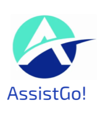
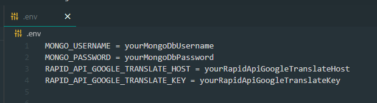

# AssistGo! App

This is the back end server for the AssistGo! app!

  

## Technologies

- Node.js
- Express.js
- TypeScript
- MongoDB Atlas
- Google Translate API (via RapidAPI)
- Google Cloud Storage Bucket API

## Pre-requisites

- Have `NPM`, `NodeJS` and `TypeScript` Installed Globally on your system.
- Have a Google Cloud Account with a Google Keyfile with Google Bucket Storage permissions, as well as having the Google Cloud Storage Bucket API enabled on the Google Cloud account.
- Paste the `google_keyfile.json` file in the root directory of the backend server (the file will not come with the same name, so make sure to rename it to google_keyfile.json)
- A `.env` file in the root directory of the backend server, that includes your MongoDB cluster database username and password. Additionally it should also include your Rapid API Google Translate Host, and Rapid API Google Translate Key. The following format must be followed:

  

## To install Dependencies

`npm install`

## To run in Development

`npm install -g nodemon` (Only install this if you run in development for the first time)
`npm run dev`

## To run in Production

`npm run start`
